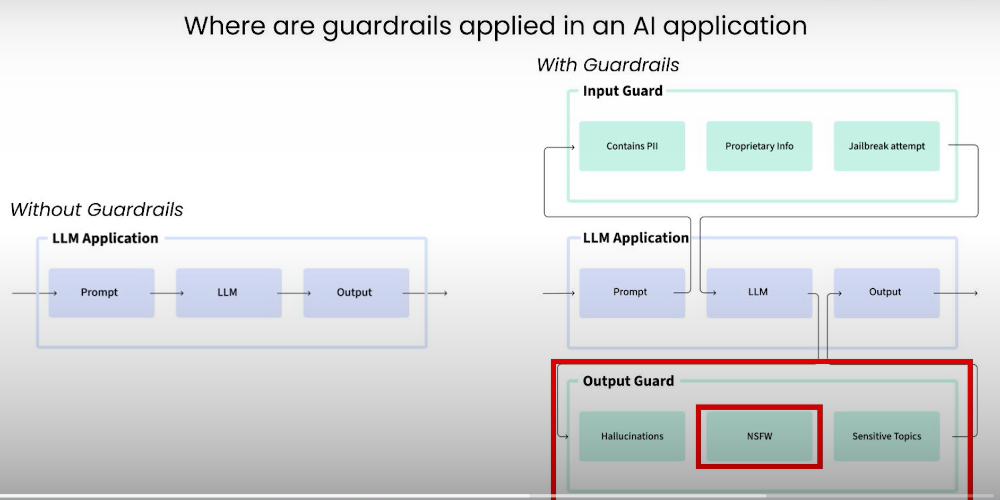
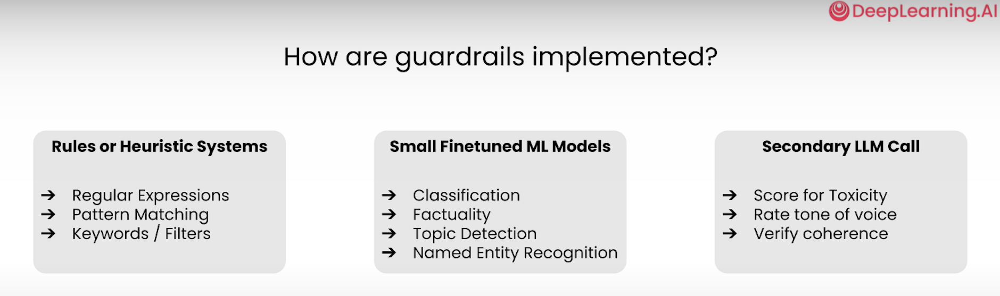

## What are the Guard Rails?
    - Guard rail is the secondary "check" or validation around the input and output of an LLM model.
    - The validation ensures that the behaviour of LLM call is Valid or not
    - Validity could mean no hallucinations, no PII leackage, roubustness to jail breaking, no profinity language, etc

## How Having guardrails in your application helps?
    - Limit worse case behaviour: Avoiding leakage of PII (personal Identity Information)
    - Measure the Occurance of undesirable behavior : Log guardrails violations, Measure LLM Refusals
    - Build More Complex Workflow (Agents):
            - each intermidiate step is constrained and reliable, so multistep applications can be enabled
            - eg. step 1 guard rails, step2 guardrails, step n guardrails
            - we can apply guardrail on each steps

